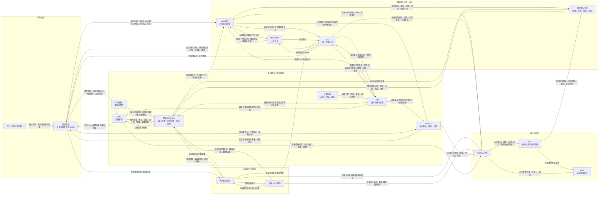

# 200 人公司身份流架构图

> 目标：从用户 / 设备开始，画到 VPN、认证入口、应用、授权、风险、审计，并标出每一步谁在验证什么。

## 1. 身份流总览



## 2. 每一步谁在验证什么

| 步骤 | 参与方 | 验证对象 | 判定要点 | 不通过时的动作 |
| --- | --- | --- | --- | --- |
| 设备准入 | MDM、策略与授权中心 | 终端设备 | 设备标识、系统版本、补丁、磁盘加密、杀毒、锁屏、越狱 / Root 状态 | 拒绝纳管，提示整改，记录准入失败 |
| 证书签发 | 终端设备、PKI / CA | 用户 / 设备证书申请 | 申请来源、证书模板、账号归属、设备是否合规、私钥是否本地生成 | 拒绝签发，记录证书申请失败 |
| VPN 网关识别 | 终端设备、VPN 网关、PKI | VPN 服务端身份 | 证书链、有效期、证书用途、主机名、可信 CA | 阻止连接，提示可能的中间人风险 |
| VPN 双向认证 | VPN 网关、PKI | 用户 / 设备身份 | 用户 / 设备证书是否有效、是否吊销、是否属于当前账号和设备 | 拒绝建立通道，记录认证失败 |
| 接入风险判断 | VPN、风险评估引擎、策略与授权中心 | 本次访问上下文 | 账号、设备、时间、地点、网络环境、历史行为 | 低风险放行，中风险 MFA，高风险阻断 |
| 统一登录 | SSO、IAM、MFA / OTP | 账号与登录人 | 账号是否在职、角色是否有效、认证因子是否绑定、OTP 是否通过 | 拒绝登录，记录登录失败或触发告警 |
| 应用授权 | 应用、API、策略与授权中心 | 应用与数据访问权限 | 菜单权限、数据范围、岗位角色、接口权限、服务凭据 | 返回无权限，记录越权尝试 |
| 审计还原 | 日志平台、SIEM、SOC | 全链路行为 | 谁、何时、从哪里、用什么设备、访问什么、做了什么 | 触发告警、工单、冻结账号、隔离设备 |
| 生命周期回收 | HR、IAM、PKI、MDM、SSO、VPN | 离职或到期身份 | 账号、角色、应用权限、证书、设备、会话是否全部回收 | 强制禁用、吊销证书、撤销会话、擦除企业数据 |

## 3. 图中的关键边界

- VPN 解决“怎么安全进入内网”，不等于应用已经登录。
- SSO 解决“统一认证入口”，不等于业务操作已经被授权。
- 授权需要落到应用、API、菜单、数据范围和关键操作。
- 证书认证不是换了名字的密码，核心是“私钥持有证明 + CA 信任链”。
- 风险判断不是一次性动作，应贯穿 VPN、SSO、应用、API 和审计响应。
- 审计必须能还原：谁、何时、从哪里、使用什么设备、访问了什么、做了什么。

## 4. 展示串讲顺序

```text
入职建身份
-> 设备合规检查
-> 用户 / 设备证书签发
-> VPN 网关可信校验
-> 用户 / 设备双向认证
-> 风险评估与 MFA
-> SSO 统一登录
-> 应用与 API 细粒度授权
-> 日志汇聚与安全响应
-> 转岗变更 / 离职回收
```