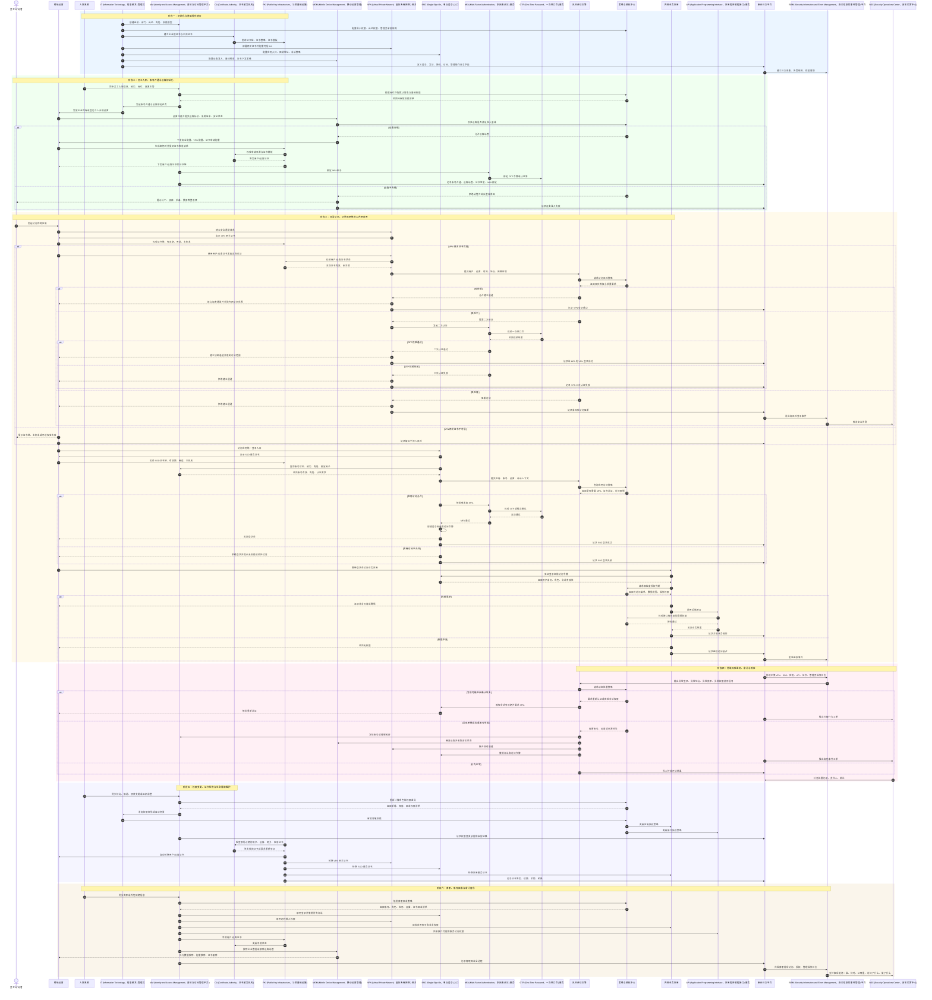

# 200 人公司身份认证系统全生命周期时序图

```mermaid
sequenceDiagram
    autonumber

    actor Employee as 员工/访问者
    participant Device as 终端设备
    participant HR as 人事系统
    participant ITAdmin as IT (Information Technology，信息技术) 管理员
    participant IAM as IAM (Identity and Access Management，身份与访问管理平台)
    participant CA as CA (Certificate Authority，证书颁发机构)
    participant PKI as PKI (Public Key Infrastructure，公钥基础设施)
    participant MDM as MDM (Mobile Device Management，移动设备管理)
    participant VPN as VPN (Virtual Private Network，虚拟专用网络) 网关
    participant SSO as SSO (Single Sign-On，单点登录) 入口
    participant MFA as MFA (Multi-Factor Authentication，多因素认证) 服务
    participant OTP as OTP (One-Time Password，一次性口令) 服务
    participant Risk as 风险评估引擎
    participant Policy as 策略与授权中心
    participant App as 内网业务应用
    participant API as API (Application Programming Interface，应用程序编程接口) 服务
    participant Log as 审计日志平台
    participant SIEM as SIEM (Security Information and Event Management，安全信息和事件管理) 平台
    participant SOC as SOC (Security Operations Center，安全运营中心)

    rect rgb(235, 245, 255)
    note over HR,PKI: 阶段一：初始化与基础信任建设
    ITAdmin->>IAM: 创建组织、部门、岗位、角色、权限模型
    ITAdmin->>Policy: 配置最小权限、岗位权限、管理员审批规则
    ITAdmin->>CA: 建立企业根证书与中间证书
    CA->>PKI: 发布证书链、证书策略、证书模板
    ITAdmin->>VPN: 部署网关证书并配置可信 CA
    ITAdmin->>SSO: 配置应用入口、回调地址、会话策略
    ITAdmin->>MDM: 配置设备准入、基线检查、证书下发策略
    ITAdmin->>Log: 定义登录、发证、授权、访问、管理操作日志字段
    Log->>SIEM: 建立日志采集、告警规则、保留周期
    end

    rect rgb(240, 255, 240)
    note over Employee,PKI: 阶段二：员工入职、账号开通与设备初始化
    HR->>IAM: 同步员工入职信息、部门、岗位、直属主管
    IAM->>Policy: 根据岗位匹配默认角色与基础权限
    Policy-->>IAM: 返回待审批权限清单
    IAM->>ITAdmin: 发起账号开通与设备绑定任务
    ITAdmin->>Device: 发放企业终端或登记个人合规设备
    Device->>MDM: 设备注册并提交设备标识、系统版本、安全状态
    MDM->>Policy: 校验设备是否满足准入基线
    alt 设备合规
        Policy-->>MDM: 允许设备纳管
        MDM->>Device: 下发安全配置、VPN 配置、证书申请配置
        Device->>PKI: 生成密钥对并提交证书签发请求
        PKI->>CA: 校验申请来源与证书模板
        CA-->>PKI: 签发用户/设备证书
        PKI-->>Device: 下发用户/设备证书和证书链
        IAM->>MFA: 绑定 MFA 因子
        MFA->>OTP: 绑定 OTP 令牌或认证器
        IAM->>Log: 记录账号开通、设备纳管、证书签发、MFA 绑定
    else 设备不合规
        Policy-->>MDM: 拒绝纳管并给出整改原因
        MDM-->>Employee: 提示补丁、加密、杀毒、锁屏等整改项
        MDM->>Log: 记录设备准入失败
    end
    end

    rect rgb(255, 250, 235)
    note over Employee,App: 阶段三：日常访问，从外部网络进入内网应用
    Employee->>Device: 发起访问内网应用
    Device->>VPN: 建立安全通道请求
    VPN->>Device: 出示 VPN 网关证书
    Device->>PKI: 校验证书链、有效期、用途、主机名
    alt VPN 网关证书可信
        Device->>VPN: 使用用户/设备证书发起双向认证
        VPN->>PKI: 校验用户/设备证书状态
        PKI-->>VPN: 返回证书有效、未吊销
        VPN->>Risk: 提交用户、设备、时间、地点、网络环境
        Risk->>Policy: 请求访问风险策略
        Policy-->>Risk: 返回风险等级与处置要求
        alt 风险低
            Risk-->>VPN: 允许建立通道
            VPN-->>Device: 建立加密通道并分配内网访问范围
            VPN->>Log: 记录 VPN 登录成功
        else 风险中
            Risk-->>VPN: 需要二次验证
            VPN->>MFA: 发起二次认证
            MFA->>OTP: 校验一次性口令
            OTP-->>MFA: 返回校验结果
            alt OTP 校验通过
                MFA-->>VPN: 二次认证通过
                VPN-->>Device: 建立加密通道并限制访问范围
                VPN->>Log: 记录带 MFA 的 VPN 登录成功
            else OTP 校验失败
                MFA-->>VPN: 二次认证失败
                VPN-->>Device: 拒绝建立通道
                VPN->>Log: 记录 VPN 二次认证失败
            end
        else 风险高
            Risk-->>VPN: 阻断访问
            VPN-->>Device: 拒绝建立通道
            VPN->>Log: 记录高风险访问阻断
            Log->>SIEM: 发送高风险登录事件
            SIEM->>SOC: 触发安全告警
        end
    else VPN 网关证书不可信
        Device-->>Employee: 提示证书链、主机名或用途校验失败
        Device->>Log: 记录疑似中间人风险
    end

    Device->>SSO: 访问应用统一登录入口
    SSO->>Device: 出示 SSO 服务证书
    Device->>PKI: 校验 SSO 证书链、有效期、用途、主机名
    SSO->>IAM: 查询账号状态、部门、角色、绑定因子
    IAM-->>SSO: 返回账号有效、角色、认证要求
    SSO->>Risk: 提交应用、账号、设备、会话上下文
    Risk->>Policy: 查询应用访问策略
    Policy-->>Risk: 返回是否需要 MFA、证书认证、访问限制
    alt 应用访问允许
        SSO->>MFA: 按策略发起 MFA
        MFA->>OTP: 校验 OTP 或推送确认
        OTP-->>MFA: 返回通过
        MFA-->>SSO: MFA 通过
        SSO->>SSO: 创建登录会话和访问令牌
        SSO-->>Device: 返回登录态
        SSO->>Log: 记录 SSO 登录成功
    else 应用访问不允许
        SSO-->>Device: 拒绝登录并提示无权限或风险过高
        SSO->>Log: 记录 SSO 登录失败
    end

    Device->>App: 携带登录态访问业务应用
    App->>SSO: 验证登录态和访问令牌
    SSO-->>App: 返回用户身份、角色、会话有效性
    App->>Policy: 请求细粒度授权判断
    Policy-->>App: 返回可访问菜单、数据范围、操作权限
    alt 权限满足
        App-->>Device: 返回业务页面或数据
        App->>API: 调用后端接口
        API->>Policy: 校验接口级权限和数据权限
        Policy-->>API: 授权通过
        API-->>App: 返回业务结果
        App->>Log: 记录关键业务操作
    else 权限不足
        App-->>Device: 返回无权限
        App->>Log: 记录越权访问尝试
        Log->>SIEM: 发送越权事件
    end
    end

    rect rgb(255, 240, 245)
    note over Risk,SOC: 阶段四：持续风险监测、审计与响应
    Log->>SIEM: 持续汇聚 VPN、SSO、应用、API、证书、管理员操作日志
    SIEM->>Risk: 输出异常登录、异常地点、异常频率、异常权限使用信号
    Risk->>Policy: 请求动态处置策略
    alt 发现可疑但未确认攻击
        Policy-->>Risk: 要求重新认证或降低会话权限
        Risk->>SSO: 缩短会话有效期并要求 MFA
        SSO-->>Device: 触发重新认证
        Log->>SOC: 推送可疑行为工单
    else 发现明确攻击或账号失陷
        Policy-->>Risk: 阻断账号、设备或来源地址
        Risk->>IAM: 冻结账号或强制改密
        Risk->>MDM: 隔离设备并收集安全状态
        Risk->>VPN: 断开现有通道
        Risk->>SSO: 撤销会话和访问令牌
        Log->>SOC: 推送高危事件工单
    else 行为正常
        Risk->>Log: 写入持续评估结果
    end
    SOC->>Log: 补充处置记录、责任人、结论
    end

    rect rgb(245, 245, 255)
    note over IAM,CA: 阶段五：权限变更、证书轮换与生命周期维护
    HR->>IAM: 同步转岗、借调、项目变更或组织调整
    IAM->>Policy: 重新计算角色和权限差异
    Policy-->>IAM: 返回新增、保留、回收权限清单
    IAM->>ITAdmin: 发起权限审批或自动变更
    ITAdmin->>Policy: 审批高敏权限
    Policy->>App: 更新应用授权策略
    Policy->>API: 更新接口授权策略
    IAM->>Log: 记录权限变更依据和审批链路

    PKI->>CA: 检查即将过期的用户、设备、网关、应用证书
    CA-->>PKI: 签发续期证书或要求重新验证
    PKI->>Device: 自动轮换用户/设备证书
    PKI->>VPN: 轮换 VPN 网关证书
    PKI->>SSO: 轮换 SSO 服务证书
    PKI->>App: 轮换应用服务证书
    PKI->>Log: 记录证书签发、续期、吊销、轮换
    end

    rect rgb(250, 245, 235)
    note over HR,SIEM: 阶段六：离职、账号回收与审计留存
    HR->>IAM: 同步离职或外包到期信息
    IAM->>Policy: 触发离职回收策略
    Policy-->>IAM: 返回账号、角色、应用、设备、证书回收清单
    IAM->>SSO: 禁用登录并撤销所有会话
    IAM->>VPN: 禁用远程接入权限
    IAM->>App: 回收应用账号和业务权限
    IAM->>API: 回收接口凭据和服务访问权限
    IAM->>PKI: 吊销用户/设备证书
    PKI->>CA: 更新吊销状态
    IAM->>MDM: 擦除企业数据或解除设备纳管
    MDM-->>Device: 执行数据擦除、配置移除、证书删除
    IAM->>Log: 记录离职回收全过程
    Log->>SIEM: 归档离职前后访问、授权、管理操作日志
    SIEM->>SOC: 支持事后追溯：谁、何时、从哪里、访问了什么、做了什么
    end
```
